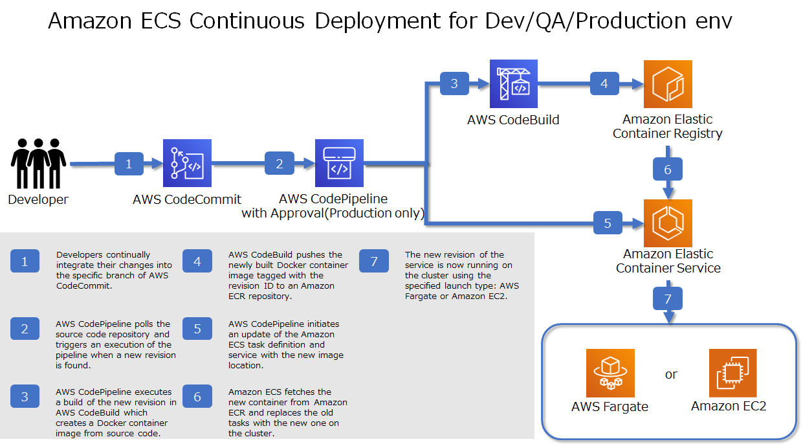

# ECS Continuous Deployment

This ECS Continuous Deployment architecture demonstrates how to achieve
[continuous deployment][continuous-deployment] of an application to Amazon
Elastic Container Service (Amazon ECS) using AWS CodePipeline and AWS
CodeBuild. With continuous deployment, software revisions are deployed to a
runtime environment automatically with explicit approval(Production env only) from a developer, making the entire software release process automated.

Launching this AWS CloudFormation stack provisions a continuous deployment
process that uses AWS CodePipeline to monitor AWS CodeCommit repository for new commits and AWS CodeBuild to create a new Docker container image and to push it into Amazon Elastic Container Registry (Amazon ECR).

When creating this stack, you can opt to deploy the service onto [AWS
Fargate][fargate] or [Amazon EC2][ec2]. AWS Fargate allows you to run containers
without managing clusters or services. If you choose Amazon EC2, an Auto Scaling
group of t2.micro instances will be created to host your service.

[][architecture]
## Prerequisite
#### 1. Create IAM service role for CodePipeline, CodeBuild
ex) IAM policy for the CodePipeline service roles
```Console
{
    "Statement": [
        {
            "Action": [
                "iam:PassRole"
            ],
            "Resource": "*",
            "Effect": "Allow",
            "Condition": {
                "StringEqualsIfExists": {
                    "iam:PassedToService": [
                        "cloudformation.amazonaws.com",
                        "elasticbeanstalk.amazonaws.com",
                        "ec2.amazonaws.com",
                        "ecs-tasks.amazonaws.com"
                    ]
                }
            }
        },
        {
            "Action": [
                "codecommit:CancelUploadArchive",
                "codecommit:GetBranch",
                "codecommit:GetCommit",
                "codecommit:GetUploadArchiveStatus",
                "codecommit:UploadArchive"
            ],
            "Resource": "*",
            "Effect": "Allow"
        },
        {
            "Action": [
                "codedeploy:CreateDeployment",
                "codedeploy:GetApplication",
                "codedeploy:GetApplicationRevision",
                "codedeploy:GetDeployment",
                "codedeploy:GetDeploymentConfig",
                "codedeploy:RegisterApplicationRevision"
            ],
            "Resource": "*",
            "Effect": "Allow"
        },
        {
            "Action": [
                "elasticbeanstalk:*",
                "ec2:*",
                "elasticloadbalancing:*",
                "autoscaling:*",
                "cloudwatch:*",
                "s3:*",
                "sns:*",
                "cloudformation:*",
                "rds:*",
                "sqs:*",
                "ecs:*"
            ],
            "Resource": "*",
            "Effect": "Allow"
        },
        {
            "Action": [
                "lambda:InvokeFunction",
                "lambda:ListFunctions"
            ],
            "Resource": "*",
            "Effect": "Allow"
        },
        {
            "Action": [
                "opsworks:CreateDeployment",
                "opsworks:DescribeApps",
                "opsworks:DescribeCommands",
                "opsworks:DescribeDeployments",
                "opsworks:DescribeInstances",
                "opsworks:DescribeStacks",
                "opsworks:UpdateApp",
                "opsworks:UpdateStack"
            ],
            "Resource": "*",
            "Effect": "Allow"
        },
        {
            "Action": [
                "cloudformation:CreateStack",
                "cloudformation:DeleteStack",
                "cloudformation:DescribeStacks",
                "cloudformation:UpdateStack",
                "cloudformation:CreateChangeSet",
                "cloudformation:DeleteChangeSet",
                "cloudformation:DescribeChangeSet",
                "cloudformation:ExecuteChangeSet",
                "cloudformation:SetStackPolicy",
                "cloudformation:ValidateTemplate"
            ],
            "Resource": "*",
            "Effect": "Allow"
        },
        {
            "Action": [
                "codebuild:BatchGetBuilds",
                "codebuild:StartBuild"
            ],
            "Resource": "*",
            "Effect": "Allow"
        },
        {
            "Effect": "Allow",
            "Action": [
                "devicefarm:ListProjects",
                "devicefarm:ListDevicePools",
                "devicefarm:GetRun",
                "devicefarm:GetUpload",
                "devicefarm:CreateUpload",
                "devicefarm:ScheduleRun"
            ],
            "Resource": "*"
        },
        {
            "Effect": "Allow",
            "Action": [
                "servicecatalog:ListProvisioningArtifacts",
                "servicecatalog:CreateProvisioningArtifact",
                "servicecatalog:DescribeProvisioningArtifact",
                "servicecatalog:DeleteProvisioningArtifact",
                "servicecatalog:UpdateProduct"
            ],
            "Resource": "*"
        },
        {
            "Effect": "Allow",
            "Action": [
                "cloudformation:ValidateTemplate"
            ],
            "Resource": "*"
        },
        {
            "Effect": "Allow",
            "Action": [
                "ecr:DescribeImages"
            ],
            "Resource": "*"
        }
    ],
    "Version": "2012-10-17"
}
```
ex) IAM policy for the CodeBuild service role
```Console
{
    "Version": "2012-10-17",
    "Statement": [
        {
            "Effect": "Allow",
            "Resource": [
                "arn:aws:logs:ap-northeast-1:<AWS Account ID>:log-group:/aws/codebuild/<systemname-prefix>-build-nodejs",
                "arn:aws:logs:ap-northeast-1:<AWS Account ID>:log-group:/aws/codebuild/<systemname-prefix>-build-nodejs:*",
                "arn:aws:logs:ap-northeast-1:<AWS Account ID>:log-group:/aws/codebuild/<systemname-prefix>-build-containerImage",
                "arn:aws:logs:ap-northeast-1:<AWS Account ID>:log-group:/aws/codebuild/<systemname-prefix>-build-containerImage:*"
            ],
            "Action": [
                "logs:CreateLogGroup",
                "logs:CreateLogStream",
                "logs:PutLogEvents"
            ]
        },
        {
            "Effect": "Allow",
            "Resource": [
                "arn:aws:s3:::<systename-prefix>-source-code*"
            ],
            "Action": [
                "s3:PutObject",
                "s3:GetObject",
                "s3:GetObjectVersion"
            ]
        }
    ]
}
```
#### 2. Create CodeCommit repository with 3 branches (master/qa/prod)
#### 3. Create a S3 bucket for an artifact store of a CodePipeline
#### 4. Create SNS topic for an production release approval notification
#### 5. Create deploy target 3 ECS clusters (Dev/QA/Producion)
#### 6. Create 3 ECR repositories (Dev/QA/Producion)

## Creating the pipeline

#### 1. Download the contents from the GitHub repository

Copy the contents [Amazon ECS sample
app](https://github.com/strada501/aws-ecs-pipeline-sample-app) GitHub repository.

#### 2. Create CodeCommit repository and push the source code of the Amazon ECS sample app.

#### 3. Create another 2 branches at the CodeCommit repository

#### 4. Create the CloudFormation stack of a CodeBuild project for building sample app

Deploy | Region Name | Region
:---: | ------------ | -------------
[🚀][us-east-1-build1] | US East (N. Virginia) | us-east-1
[🚀][us-east-2-build1] | US East (Ohio) | us-east-2
[🚀][us-west-1-build1] | US West (N. California) | us-west-1
[🚀][us-west-2-build1] | US West (Oregon) | us-west-2
[🚀][eu-west-1-build1] | EU (Ireland) | eu-west-1
[🚀][eu-west-2-build1] | EU (London) | eu-west-2
[🚀][eu-central-1-build1] | EU (Frankfurt) | eu-central-1
[🚀][ap-southeast-1-build1] | Asia Pacific (Singapore) | ap-southeast-1
[🚀][ap-southeast-2-build1] | Asia Pacific (Sydney) | ap-southeast-2
[🚀][ap-northeast-1-build1] | Asia Pacific (Tokyo) | ap-northeast-1
[🚀][ap-northeast-2-build1] | Asia Pacific (Seoul) | ap-northeast-2
[🚀][ca-central-1-build1] | Canada (Central) | ca-central-1

This architecture can only be deployed to Regions which have all
necessary services available. See the [Region
Table](https://aws.amazon.com/about-aws/global-infrastructure/regional-product-services/)
for information about service availability.

The CloudFormation template requires the following parameters:

- CodeBuild Settings
  - **CodeBuild project Name for Node.js application build**
  - **CodeBuild service role Name for Node.js application build**

#### 5. Create the CloudFormation stack of a CodeBuild project for building a container image

Deploy | Region Name | Region
:---: | ------------ | -------------
[🚀][us-east-1-build2] | US East (N. Virginia) | us-east-1
[🚀][us-east-2-build2] | US East (Ohio) | us-east-2
[🚀][us-west-1-build2] | US West (N. California) | us-west-1
[🚀][us-west-2-build2] | US West (Oregon) | us-west-2
[🚀][eu-west-1-build2] | EU (Ireland) | eu-west-1
[🚀][eu-west-2-build2] | EU (London) | eu-west-2
[🚀][eu-central-1-build2] | EU (Frankfurt) | eu-central-1
[🚀][ap-southeast-1-build2] | Asia Pacific (Singapore) | ap-southeast-1
[🚀][ap-southeast-2-build2] | Asia Pacific (Sydney) | ap-southeast-2
[🚀][ap-northeast-1-build2] | Asia Pacific (Tokyo) | ap-northeast-1
[🚀][ap-northeast-2-build2] | Asia Pacific (Seoul) | ap-northeast-2
[🚀][ca-central-1-build2] | Canada (Central) | ca-central-1

This architecture can only be deployed to Regions which have all
necessary services available. See the [Region
Table](https://aws.amazon.com/about-aws/global-infrastructure/regional-product-services/)
for information about service availability.

The CloudFormation template requires the following parameters:

- CodeBuild Settings
  - **CodeBuild project Name for Node.js application build**
  - **CodeBuild service role Name for Node.js application build**

#### 6. Create the CloudFormation stack of 3 CodePipeline pipelines (Dev/QA/Production)

Deploy | Region Name | Region
:---: | ------------ | -------------
[🚀][us-east-1-pipeline] | US East (N. Virginia) | us-east-1
[🚀][us-east-2-pipeline] | US East (Ohio) | us-east-2
[🚀][us-west-1-pipeline] | US West (N. California) | us-west-1
[🚀][us-west-2-pipeline] | US West (Oregon) | us-west-2
[🚀][eu-west-1-pipeline] | EU (Ireland) | eu-west-1
[🚀][eu-west-2-pipeline] | EU (London) | eu-west-2
[🚀][eu-central-1-pipeline] | EU (Frankfurt) | eu-central-1
[🚀][ap-southeast-1-pipeline] | Asia Pacific (Singapore) | ap-southeast-1
[🚀][ap-southeast-2-pipeline] | Asia Pacific (Sydney) | ap-southeast-2
[🚀][ap-northeast-1-pipeline] | Asia Pacific (Tokyo) | ap-northeast-1
[🚀][ap-northeast-2-pipeline] | Asia Pacific (Seoul) | ap-northeast-2
[🚀][ca-central-1-pipeline] | Canada (Central) | ca-central-1

This architecture can only be deployed to Regions which have all
necessary services available. See the [Region
Table](https://aws.amazon.com/about-aws/global-infrastructure/regional-product-services/)
for information about service availability.

The CloudFormation template requires the following parameters:

- CodePipeline Settings
  - **Code Pipeline Name for the development environment**
  - **Code Pipeline Name for the quality assurance environment**
  - **Code Pipeline Name for the production environment**
  - **CodePipeline service role name**
  - **S3 bucket name for a CodePipeline artifact store**
  - **SNS topic name for the approval of a production deployment**

- CodeCommit Settings
  - **CodeCommit repository name**
  - **CodeCommit Branch for the development environment**
  - **CodeCommit Branch for the quality assurance environment**
  - **CodeCommit Branch for the production environment**

- CodeBuild Settings
  - **CodeBuild project name for Node.js application build**
  - **CodeBuild project name for container image build**

- ECS Settings
  - **ECR Repository Name for the development environment**
  - **ECR Repository Name for the quality assurance environment**
  - **ECR Repository Name for the production environment**
  - **ECS Container Name**
  - **ECS Cluster name for the development environment?**
  - **ECS Cluster name for the quality assurance environment?**
  - **ECS Cluster name for the production environment?**
  - **ECS Service name for the development environment?**
  - **ECS Service name for the quality assurance environment?**
  - **ECS Service name for the production environment?**  

The CloudFormation stack provides the following output:

- **PipelineUrl**: The continuous deployment pipeline in the AWS Management
  Console.

### Testing the pipeline

After the CloudFormation stack is created, the latest commit to the CodeCommit
repository is run through the pipeline and deployed to ECS. Open the
**PipelineUrl** to watch the first revision run through the CodePipeline
pipeline. After the deploy step turns green, open the URL which loads a message: "Hello world"

To test continuous deployment, make a change to app.js in the
aws-ecs-pipeline-sample-app repository and push it to CodeCommit master branch. CodePipeline detects the change, builds the new application, and deploys it to your development cluster automatically. After the pipeline finishes deploying the revision, reload the page to see the changes made.

To test quality assurance environment, merge source code from master branch into qa branch. CodePipeline detects the change, builds the new application, and deploys it to your quality assurance cluster automatically.

To test production environment, merge source code from qa branch into production branch. CodePipeline detects the change and suspend pipeline steps to get approval for production release. So you have to approve to execute pipeline steps in the CodePipeline console. After approval CodePipeline builds the new application and deploys it to your production cluseter automatically.

## License

This reference architecture sample is [licensed][license] under Apache 2.0.

[continuous-deployment]: https://aws.amazon.com/devops/continuous-delivery/
[architecture]: images/architecture.pdf
[license]: LICENSE
[fargate]: https://aws.amazon.com/fargate/
[ec2]: https://aws.amazon.com/ec2/
[launch-types]: https://docs.aws.amazon.com/AmazonECS/latest/developerguide/launch_types.html
[us-east-1-pipeline]: https://console.aws.amazon.com/cloudformation/home?region=us-east-1#/stacks/create/review?templateURL=https://cf-templates-strada.s3-ap-northeast-1.amazonaws.com/ecs-continuous-deployment/deployment-pipeline-for-all-env.yaml
[us-east-2-pipeline]: https://console.aws.amazon.com/cloudformation/home?region=us-east-2#/stacks/create/review?templateURL=https://cf-templates-strada.s3-ap-northeast-1.amazonaws.com/ecs-continuous-deployment/deployment-pipeline-for-all-env.yaml
[us-west-1-pipeline]: https://console.aws.amazon.com/cloudformation/home?region=us-west-1#/stacks/create/review?templateURL=https://cf-templates-strada.s3-ap-northeast-1.amazonaws.com/ecs-continuous-deployment/deployment-pipeline-for-all-env.yaml
[us-west-2-pipeline]: https://console.aws.amazon.com/cloudformation/home?region=us-west-2#/stacks/create/review?templateURL=https://cf-templates-strada.s3-ap-northeast-1.amazonaws.com/ecs-continuous-deployment/deployment-pipeline-for-all-env.yaml
[eu-west-1-pipeline]: https://console.aws.amazon.com/cloudformation/home?region=eu-west-1#/stacks/create/review?templateURL=https://cf-templates-strada.s3-ap-northeast-1.amazonaws.com/ecs-continuous-deployment/deployment-pipeline-for-all-env.yaml
[eu-west-2-pipeline]: https://console.aws.amazon.com/cloudformation/home?region=eu-west-2#/stacks/create/review?templateURL=https://cf-templates-strada.s3-ap-northeast-1.amazonaws.com/ecs-continuous-deployment/deployment-pipeline-for-all-env.yaml
[eu-central-1-pipeline]: https://console.aws.amazon.com/cloudformation/home?region=eu-central-1#/stacks/create/review?templateURL=https://cf-templates-strada.s3-ap-northeast-1.amazonaws.com/ecs-continuous-deployment/deployment-pipeline-for-all-env.yaml
[ap-southeast-1-pipeline]: https://console.aws.amazon.com/cloudformation/home?region=ap-southeast-1#/stacks/create/review?templateURL=https://cf-templates-strada.s3-ap-northeast-1.amazonaws.com/ecs-continuous-deployment/deployment-pipeline-for-all-env.yaml
[ap-southeast-2-pipeline]: https://console.aws.amazon.com/cloudformation/home?region=ap-southeast-2#/stacks/create/review?templateURL=https://cf-templates-strada.s3-ap-northeast-1.amazonaws.com/ecs-continuous-deployment/deployment-pipeline-for-all-env.yaml
[ap-northeast-1-pipeline]: https://console.aws.amazon.com/cloudformation/home?region=ap-northeast-1#/stacks/create/review?templateURL=https://cf-templates-strada.s3-ap-northeast-1.amazonaws.com/ecs-continuous-deployment/deployment-pipeline-for-all-env.yaml
[ap-northeast-2-pipeline]: https://console.aws.amazon.com/cloudformation/home?region=ap-northeast-2#/stacks/create/review?stackName=ECS-ContinuousDeployment&templateURL=https://s3.amazonaws.com/ecs-refarch-continuous-deployment/ecs-refarch-continuous-deployment.yaml&param_LaunchType=EC2
[ca-central-1-pipeline]: https://console.aws.amazon.com/cloudformation/home?region=ca-central-1#/stacks/create/review?templateURL=https://cf-templates-strada.s3-ap-northeast-1.amazonaws.com/ecs-continuous-deployment/deployment-pipeline-for-all-env.yaml
[us-east-1-build1]: https://console.aws.amazon.com/cloudformation/home?region=us-east-1#/stacks/create/review?templateURL=https://cf-templates-strada.s3-ap-northeast-1.amazonaws.com/ecs-continuous-deployment/code-build-nodejs.yaml
[us-east-2-build1]: https://console.aws.amazon.com/cloudformation/home?region=us-east-2#/stacks/create/review?templateURL=https://cf-templates-strada.s3-ap-northeast-1.amazonaws.com/ecs-continuous-deployment/code-build-nodejs.yaml
[us-west-1-build1]: https://console.aws.amazon.com/cloudformation/home?region=us-west-1#/stacks/create/review?templateURL=https://cf-templates-strada.s3-ap-northeast-1.amazonaws.com/ecs-continuous-deployment/code-build-nodejs.yaml
[us-west-2-build1]: https://console.aws.amazon.com/cloudformation/home?region=us-west-2#/stacks/create/review?templateURL=https://cf-templates-strada.s3-ap-northeast-1.amazonaws.com/ecs-continuous-deployment/code-build-nodejs.yaml
[eu-west-1-build1]: https://console.aws.amazon.com/cloudformation/home?region=eu-west-1#/stacks/create/review?templateURL=https://cf-templates-strada.s3-ap-northeast-1.amazonaws.com/ecs-continuous-deployment/code-build-nodejs.yaml
[eu-west-2-build1]: https://console.aws.amazon.com/cloudformation/home?region=eu-west-2#/stacks/create/review?templateURL=https://cf-templates-strada.s3-ap-northeast-1.amazonaws.com/ecs-continuous-deployment/code-build-nodejs.yaml
[eu-central-1-build1]: https://console.aws.amazon.com/cloudformation/home?region=eu-central-1#/stacks/create/review?templateURL=https://cf-templates-strada.s3-ap-northeast-1.amazonaws.com/ecs-continuous-deployment/code-build-nodejs.yaml
[ap-southeast-1-build1]: https://console.aws.amazon.com/cloudformation/home?region=ap-southeast-1#/stacks/create/review?templateURL=https://cf-templates-strada.s3-ap-northeast-1.amazonaws.com/ecs-continuous-deployment/code-build-nodejs.yaml
[ap-southeast-2-build1]: https://console.aws.amazon.com/cloudformation/home?region=ap-southeast-2#/stacks/create/review?templateURL=https://cf-templates-strada.s3-ap-northeast-1.amazonaws.com/ecs-continuous-deployment/code-build-nodejs.yaml
[ap-northeast-1-build1]: https://console.aws.amazon.com/cloudformation/home?region=ap-northeast-1#/stacks/create/review?templateURL=https://cf-templates-strada.s3-ap-northeast-1.amazonaws.com/ecs-continuous-deployment/code-build-nodejs.yaml
[ap-northeast-2-build1]: https://console.aws.amazon.com/cloudformation/home?region=ap-northeast-2#/stacks/create/review?stackName=ECS-ContinuousDeployment&templateURL=https://s3.amazonaws.com/ecs-refarch-continuous-deployment/ecs-refarch-continuous-deployment.yaml&param_LaunchType=EC2
[ca-central-1-build1]: https://console.aws.amazon.com/cloudformation/home?region=ca-central-1#/stacks/create/review?templateURL=https://cf-templates-strada.s3-ap-northeast-1.amazonaws.com/ecs-continuous-deployment/code-build-nodejs.yaml
[us-east-1-build2]: https://console.aws.amazon.com/cloudformation/home?region=us-east-1#/stacks/create/review?templateURL=https://cf-templates-strada.s3-ap-northeast-1.amazonaws.com/ecs-continuous-deployment/code-build-containerImage.yaml
[us-east-2-build2]: https://console.aws.amazon.com/cloudformation/home?region=us-east-2#/stacks/create/review?templateURL=https://cf-templates-strada.s3-ap-northeast-1.amazonaws.com/ecs-continuous-deployment/code-build-containerImage.yaml
[us-west-1-build2]: https://console.aws.amazon.com/cloudformation/home?region=us-west-1#/stacks/create/review?templateURL=https://cf-templates-strada.s3-ap-northeast-1.amazonaws.com/ecs-continuous-deployment/code-build-containerImage.yaml
[us-west-2-build2]: https://console.aws.amazon.com/cloudformation/home?region=us-west-2#/stacks/create/review?templateURL=https://cf-templates-strada.s3-ap-northeast-1.amazonaws.com/ecs-continuous-deployment/code-build-containerImage.yaml
[eu-west-1-build2]: https://console.aws.amazon.com/cloudformation/home?region=eu-west-1#/stacks/create/review?templateURL=https://cf-templates-strada.s3-ap-northeast-1.amazonaws.com/ecs-continuous-deployment/code-build-containerImage.yaml
[eu-west-2-build2]: https://console.aws.amazon.com/cloudformation/home?region=eu-west-2#/stacks/create/review?templateURL=https://cf-templates-strada.s3-ap-northeast-1.amazonaws.com/ecs-continuous-deployment/code-build-containerImage.yaml
[eu-central-1-build2]: https://console.aws.amazon.com/cloudformation/home?region=eu-central-1#/stacks/create/review?templateURL=https://cf-templates-strada.s3-ap-northeast-1.amazonaws.com/ecs-continuous-deployment/code-build-containerImage.yaml
[ap-southeast-1-build2]: https://console.aws.amazon.com/cloudformation/home?region=ap-southeast-1#/stacks/create/review?templateURL=https://cf-templates-strada.s3-ap-northeast-1.amazonaws.com/ecs-continuous-deployment/code-build-containerImage.yaml
[ap-southeast-2-build2]: https://console.aws.amazon.com/cloudformation/home?region=ap-southeast-2#/stacks/create/review?templateURL=https://cf-templates-strada.s3-ap-northeast-1.amazonaws.com/ecs-continuous-deployment/code-build-containerImage.yaml
[ap-northeast-1-build2]: https://console.aws.amazon.com/cloudformation/home?region=ap-northeast-1#/stacks/create/review?templateURL=https://cf-templates-strada.s3-ap-northeast-1.amazonaws.com/ecs-continuous-deployment/code-build-containerImage.yaml
[ap-northeast-2-build2]: https://console.aws.amazon.com/cloudformation/home?region=ap-northeast-2#/stacks/create/review?stackName=ECS-ContinuousDeployment&templateURL=https://s3.amazonaws.com/ecs-refarch-continuous-deployment/ecs-refarch-continuous-deployment.yaml&param_LaunchType=EC2
[ca-central-1-build2]: https://console.aws.amazon.com/cloudformation/home?region=ca-central-1#/stacks/create/review?templateURL=https://cf-templates-strada.s3-ap-northeast-1.amazonaws.com/ecs-continuous-deployment/code-build-containerImage.yaml
